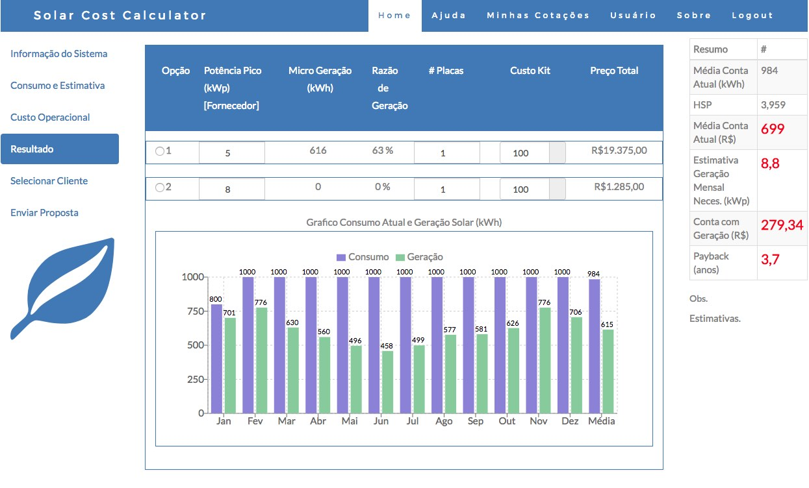

# Costumer React
SPA app to support creation of commercial proposals for end costumers.
(Front-end)
This system is intended now for local environment of Electrical Energy companies, costs and taxes and will be available to other countries in the future. Currently mostly supported in Portuguse.



* [Technical Stack](#technical-stack)
* [Architecture](#architecture)
* [Main features](#main-features)
* [Environment Variables](#environment-variables)
* [Tests](#tests)
* [How to Run](#how-to-run)
* [Missing Features](#missing-features)

## Technical Stack
* Language - JavaScript/ES6/ES7/Babel. React components are written on ES6/ES7 using Babel transpiler.
* Back-end - Node.js/Express.js, Mongojs/MongoDB
* Front-end -  React/Redux/React Router/Redux-thunk middleware
* React-Bootstrap for clean UI and CSS basis
* Graphics - Recharts
* Tests - Jest (TBD)
* Webpack, ESLint, VSCode, 

## Architecture
The application is built in client-server architecture with Node.js back-end and React front-end. The front-end
is organized in many components to handle specific tasks.
The source files are divided in folders inside js/source directory as follows:
* Actions, Actiontypes: Redux actions definitions and fetches
* Reduxers: redux reducers: currently in a single file. All calculations stored here.
* Containers: Holds the main container that connects redux data to child components as props
* Components: a component for each piece of meaningfull code (can be stateless functional of statefull)
* App.js: Router and Login (authentication)
* index.js: redux and middleware declations
* config.js: config based app definitions

## Main features
The main features are:
* Body: Redux container and bootstrap-tabs based main application
* NavbarTop: handles menu navbar
* Calculation of solar panels installation estimations, consumption and costs
* Costumers database (mongoDB)
* Bootstrap clean look and feel
* Graphics creation for monthly consumption and estimation
* Proposal text creation to be submitted to costumer by email
* All sorts of configuration and initial conditions
* UX FLOW:
  *  User login in
  *  user input the consumption of electrical energy bill monthly values, kWh month cost by electrical company
  *  User enters installation costs
  *  In Results tab user inserts the cost of system based in power calculation for costumer
  *  User inserts the costumer information for proposal sending and database storaging
  *  User generates the proposal in HTML with graphics to send to costumer


## Environment Variables
Before testing or running the service should be properly configured with following environment variables.

Key | Value | Description
:-- | :-- | :-- 
process.env.NODE_ENV | `production` or `development` | Defines the API entry points for testing or production.


## Tests

```
To be done for React components using Jest , enzyme
```

## How to Run

Needs to install the backend counterpart before and start the server and local (or remote) mongo database.

Using npm:
```
$ npm install
$ npm start
```

Open in your browser
```
http://localhost:8080 
```

## Missing Features
* Sign Up page in React
* Place images in Help menu
* Store proposals in database
* Final UI adjustments
* Deployment to contractor
* Create docker image
